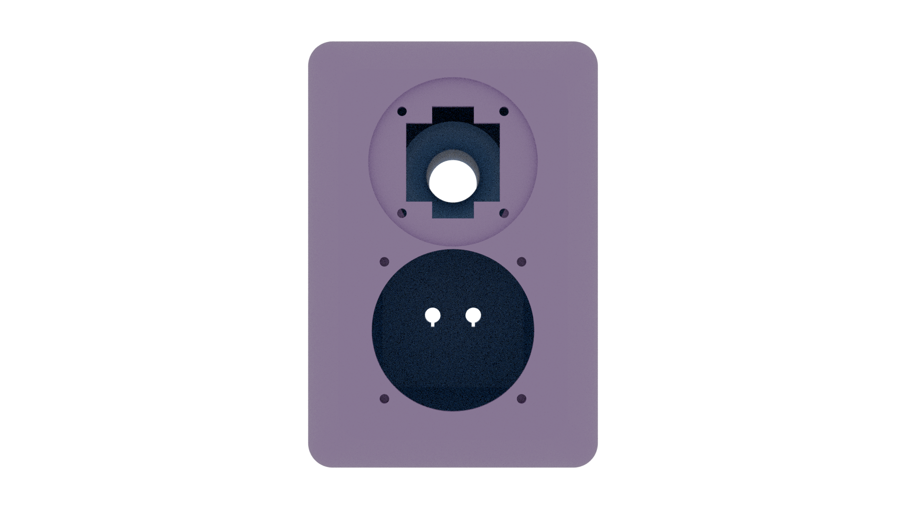
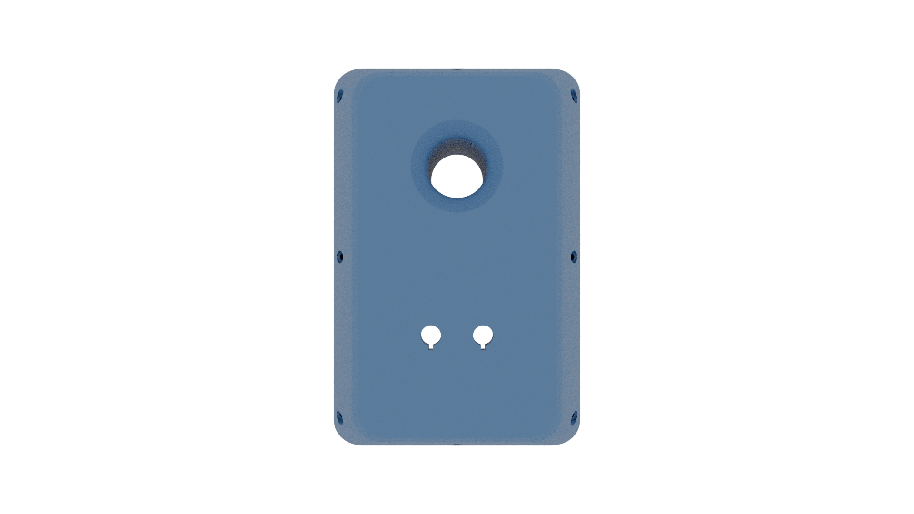
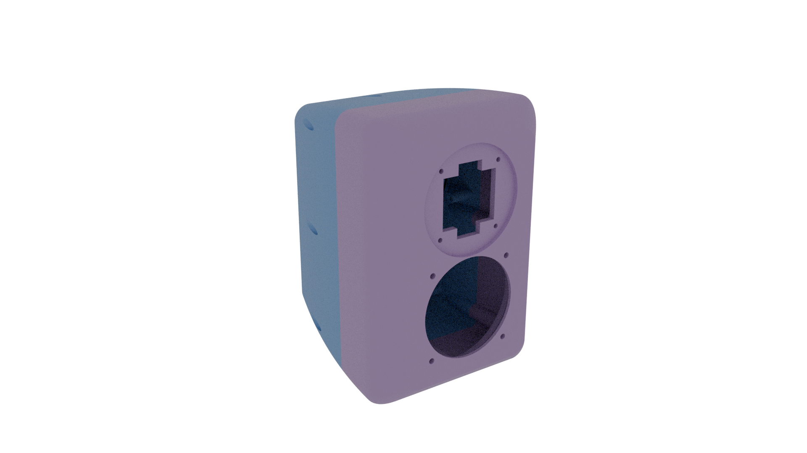
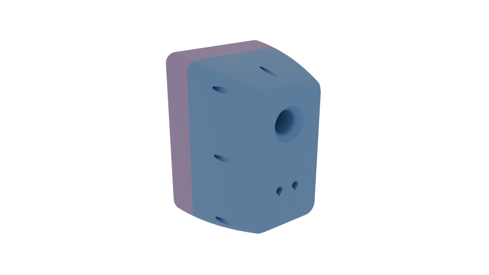
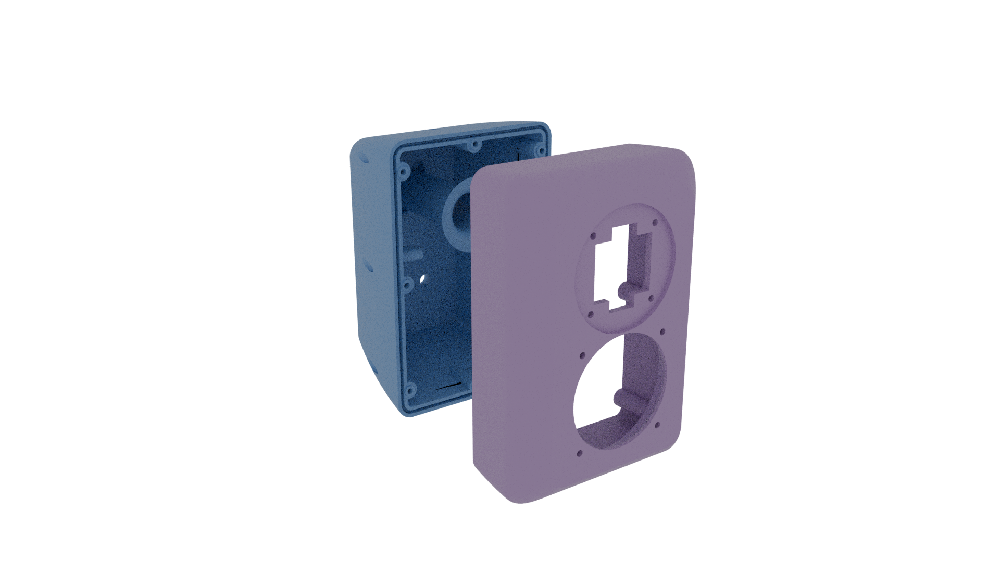
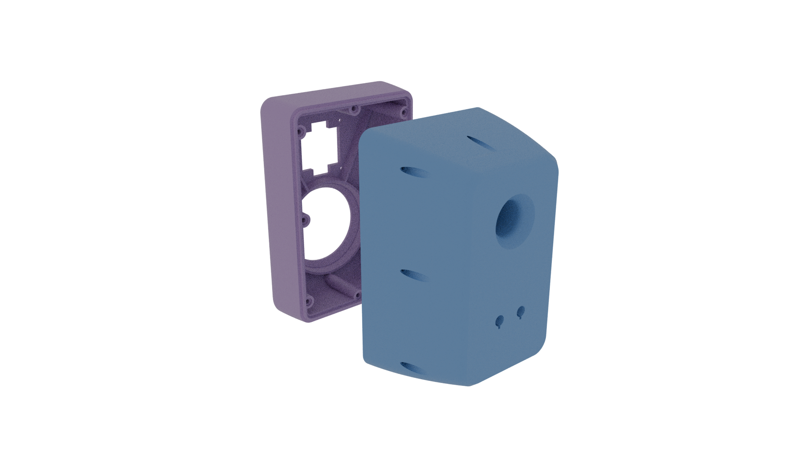
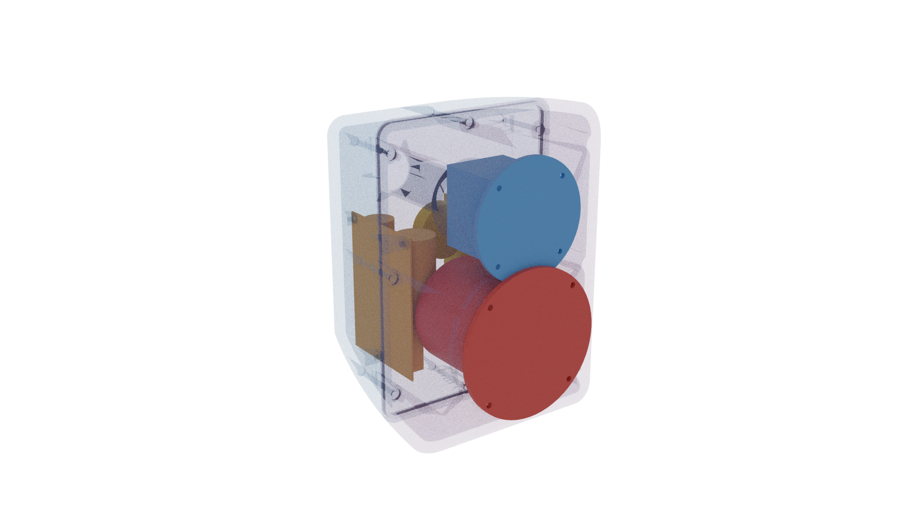
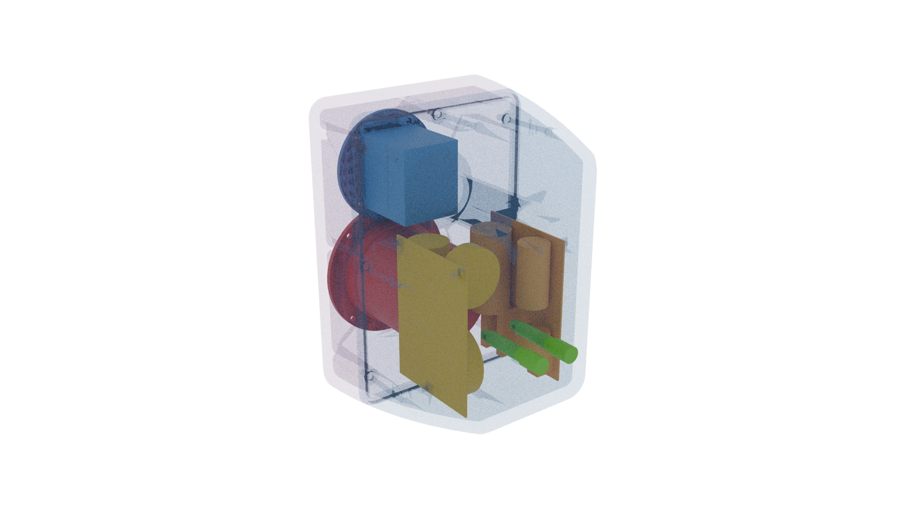

# SpeedsterAI — 3D Printed Speedster Speaker Enclosure

A parametric OpenSCAD enclosure for Paul Carmody's [Speedster](https://sites.google.com/site/undefinition/bookshelf-speakers/speedster) bookshelf speakers, replacing the original 1/2" MDF cabinet with a 3D-printed PETG curved-back wedge.

## Specifications

| Spec | Original (Carmody) | SpeedsterAI |
|------|-------------------|---------------|
| Internal volume | 5.5 L | 5.68 L net (~5.35 L effective) |
| Port tuning | ~55 Hz | ~55 Hz (same port) |
| Port | 1.375" dia × 4.5" long | 34.925mm × 114.3mm + 15mm entry bell / 45° exit chamfer |
| Woofer | Tang Band W4-1720 (surface) | Same (surface mount, M4 heat-set inserts) |
| Tweeter | Fountek NeoCD1.0 (flush) | Same (flush recess, M3 heat-set inserts) |
| Wall material | 1/2" MDF | 10mm PETG (5-6 perimeters) |
| Baffle dimensions | 152 × ~254mm (6" × 10") | 180 × 264mm |
| Back dimensions | N/A (rectangular) | 118 × 211mm, R17 corners |
| Enclosure depth | ~152mm | 205mm |
| Bracing | None | 8× pillar pairs with interlocks |
| Shape | Rectangular box | Curved-back wedge with 20mm front roundover |
| Printer | N/A | Bambu Lab H2D (350×320×325mm build volume) |

## Drivers

- **Woofer:** Tang Band W4-1720 — 4" underhung midbass with massive motor
- **Tweeter:** Fountek NeoCD1.0 — true ribbon tweeter (aluminum diaphragm, transformer coupled)
- **Crossover:** Carmody's 3rd-order electrical filters (see [Speedster page](https://sites.google.com/site/undefinition/bookshelf-speakers/speedster) for schematic)

## Design Features

**Curved-back wedge shape** with quadratic taper (power 2.0) from 180×264mm baffle to 118×211mm back over 205mm depth. Concentrates volume near the baffle where driver clearance matters most, then tapers aggressively toward the back.

**20mm front edge roundover** with a cubic Hermite spline profile, plus a 2mm 45° baffle edge chamfer. Designed for FDM printability (max overhang exactly 45° when printed baffle-down). Reduces diffraction effects above ~2737 Hz. The original MDF box had sharp baffle edges — any roundover is an improvement.

**Port flares** reduce turbulence noise and chuffing at the port openings. The cavity-side entry uses a 15mm concave quarter-circle bell for smooth airflow expansion. The back-face exit uses a 45° linear chamfer confined to the 10mm wall for FDM printability. Six triangular gusset ribs reinforce the port tube-to-back-wall junction for reliable FDM layer adhesion.

**Woofer rear chamfer** at 45° opens the baffle bore behind the driver, reducing back-wave reflections off the cutout edge.

**Front/back split** at z=80.7mm with tongue-and-groove seal joint. The split plane is aligned with the port tube front end so the port stays entirely in the back half.

**8 pillar pairs** at the split-plane perimeter provide wall reinforcement, bolt anchorage, and shear-resistant alignment via interlock boss/recess at the split face.

**Bolt counterbore landing** computed analytically from the taper cross-section — finds the z-depth where the wall provides sufficient material for a flat bolt head seat, then cuts a uniform-depth pocket for all 8 bolts.

**Crossover mounting bosses** on both side walls with heat-set inserts for M3 standoff screws. Each boss has a 45° triangular brace and D-shaped cross-section for overhang-free FDM printing. The HP and LP crossover boards mount on opposite walls.

**Component envelope validation** — a comprehensive test suite verifies all internal components (woofer, tweeter, binding posts, crossover PCBs with per-component 3D models, port tube) fit within the cavity without collisions. 20 analytical assertions run at every render; a Python geometric pipeline checks cavity containment and pair-wise collisions across 21 checks.

## Renders

### Assembled Views

| Front | Back | Side |
|-------|------|------|
|  |  |  |

| 3/4 Front | 3/4 Back |
|-----------|----------|
|  |  |

### Exploded Views

| Exploded Front | Exploded Back |
|----------------|---------------|
|  |  |

### Component Fit Views

| Component Fit Front | Component Fit Back |
|---------------------|-------------------|
|  |  |

Transparent enclosure with color-coded component envelopes: Red=woofer, Blue=tweeter, Green=binding posts, Orange/Gold=crossover HP/LP, Cyan=port tube.

## STL Downloads

- [Front half](models/speedster-ai-front.stl) — print baffle-face down
- [Back half](models/speedster-ai-back.stl) — print flat back-face down

## Using the SCAD File

### Prerequisites

- [OpenSCAD](https://openscad.org/) (tested with 2024.x)
- For printing: slicer software (Bambu Studio, PrusaSlicer, etc.)

### Rendering

Open `speedster-ai.scad` in OpenSCAD. The default view shows the full assembled enclosure. Check the console for volume estimation and driver fit diagnostics.

#### Standard Render Set

Run `./render.sh` to generate 9 standard PNG renders (1920×1080) in the `renders/` directory:

| View | Description |
|------|-------------|
| `front.png` | Front baffle face — driver cutouts, roundover, heat-set insert holes |
| `back.png` | Back panel — terminal recess, port exit flare, bolt counterbores |
| `side.png` | Side profile — taper from wide baffle to narrow back |
| `three_quarter_front.png` | 3/4 front isometric — hero shot |
| `three_quarter_back.png` | 3/4 back isometric — terminal + port + taper |
| `exploded_front.png` | Exploded from front — split halves, pillar interlocks, tongue-and-groove |
| `exploded_back.png` | Exploded from back — port tube, crossover bosses, internal features |
| `component_fit_front.png` | Component envelopes from front — transparent shell with color-coded internals |
| `component_fit_back.png` | Component envelopes from back — port tube, crossover boards, binding posts |

The `render_mode` variable can also be set from CLI: `openscad -D render_mode=1` for exploded, `=2` for front half only, `=3` for back half only, `=4` for inner cavity, `=5` for component fit.

### Exporting for Print

Run `./export.sh` to generate print-ready STL files in the `models/` directory:

```bash
./export.sh           # exports to models/ (default)
./export.sh mydir/    # exports to custom directory
```

This exports both halves with full CGAL rendering and reports geometry status. STLs are ready to import directly into your slicer.

Alternatively, in the OpenSCAD GUI, uncomment ONE export option at the bottom of the file, then Render (F6) and Export as STL (F7).

### Adjusting Volume

Change `enclosure_depth` (currently 205mm). The echo block reports estimated volume. Each 1mm of depth change ≈ 0.033L. Current verified gross volume is 5.86L (via STL export); net is 5.68L after port/pillar displacement; effective air volume is ~5.35L after subtracting crossover component displacement (~0.33L). Note: the SCAD Simpson's rule overestimates by ~0.08L because it uses only 3 sample points and doesn't fully capture the roundover zone.

### Validating the Design

Run `./validate.sh` to execute the full validation pipeline:

```bash
./validate.sh               # Full validation (assertions + geometric collision checks)
./validate.sh --skip-geometric  # Fast mode — assertions only (~2s)
```

**Phase 1 — Analytical assertions (20 checks):** Runs inside OpenSCAD at every render. Checks driver fit, cavity clearances, tweeter-port separation, crossover positioning, PCB corner containment, binding post fit, split plane validity, volume tolerance, and H2D print envelope compliance.

**Phase 2 — Geometric collision detection (21 checks):** Python script (`validate.py`) exports each component envelope as STL, then uses trimesh + manifold3d to verify cavity containment and check all pair-wise component combinations for intersections. Requires `pip install trimesh manifold3d numpy`.

The component fit can also be inspected visually with `render_mode=5` (transparent enclosure + color-coded component envelopes).

### Coordinate System

- **Z axis:** 0 at front baffle face, increasing toward back
- **Y axis:** Vertical, positive up. Woofer at y=-45, tweeter at y=+55
- **X axis:** Horizontal, positive right (facing speaker)

## Print Settings

**Material:** PETG (mandatory for airtightness and stiffness)

**Printer:** Bambu Lab H2D (350×320×325mm build volume). Both halves verified to fit within the build envelope.

| Setting | Value | Rationale |
|---------|-------|-----------|
| Layer height | 0.2mm | Good detail/speed balance |
| Perimeters | 5–6 | Fills most of 10mm wall, airtight |
| Infill | 50–80% gyroid | Fills remaining wall, adds damping |
| Top/bottom layers | 8+ | Solid baffle and back face |
| Supports | Minimal | Driver cutouts, counterbores; roundover profile is ≤45° overhang |

**Print orientation:**
- Front half: baffle face DOWN (split face up) — roundover profile designed for ≤45° overhang; best surface finish on visible face
- Back half: flat back face DOWN (split face up) — large flat surface on build plate for best adhesion

## Tolerance Test Print

Before printing the full enclosure, print the tolerance test to calibrate printer-specific fit tolerances. The test produces small bars with feature variants at ±0.3mm in 0.1mm increments, letting you find the exact offset for your printer/material/settings combination.

### Exporting the Test STL

```bash
openscad tolerance-test.scad -o models/tolerance-test.stl
```

### Printing

The STL contains four groups that should be separated in your slicer and oriented per their intended print direction:

| Group | Features | Print Orientation |
|-------|----------|-------------------|
| Face-down plate (A1, A2, A5) | M4 heatset, M3 heatset, M4 counterbore | Holes face DOWN on bed (z=0 on bed) — tests ceiling bridging |
| Through-hole plate (A4) | Binding post keyhole | Either orientation (through-hole) |
| Horizontal plate (B1) | M3 crossover boss insert | Bores enter from side face (Y axis) |
| Mating pieces (C1–C3) | Tongue, groove strip, interlock boss/recess | Flat on bed |

**Use the same print settings as the final enclosure** (PETG, 0.2mm layers, 5–6 perimeters) so the tolerances transfer accurately.

### Testing Each Feature

Each bar has 7 variants labeled with the test diameter (e.g., 5.3, 5.4, **5.6\***, 5.7...). The nominal value is marked with an asterisk (**\***). Group labels are on the front face; diameter values are on the back face.

1. **A1 / A2 — Heat-set inserts:** Press an M4 or M3 heat-set insert into each hole using a soldering iron. Find the tightest hole that still accepts the insert cleanly without excess bulging. Record that diameter.
2. **A5 — Counterbore:** Test-fit an M4 bolt head into each counterbore pocket. The bolt should drop in freely without force. The narrower through-hole above tests the bolt shank clearance.
3. **A4 — Binding post:** Test-fit a binding post terminal. The keyway slot should prevent rotation. Find the variant where the post fits snugly.
4. **B1 — Horizontal insert:** Press an M3 heat-set insert into each horizontal bore. This tests the Z-axis print tolerance (perpendicular to layer lines), which often differs from X/Y tolerance.
5. **C1/C2 — Tongue and groove:** Slide the tongue piece into each groove channel. Find the groove width where the tongue slides smoothly without wobble.
6. **C3 — Interlock:** Press the boss piece into each recess variant. Find the clearance where the boss seats fully with light press-fit resistance.

### Applying Results

Open `speedster-ai.scad` and find the print-tuned dimension variables near the top of the file. Each variable defaults to the design nominal — replace it with the value printed on the test variant that fits best:

```openscad
// Print-tuned dimensions — enter the label value from your best-fit test variant
print_m4_heatset_dia  = 5.6;   // A1: M4 heat-set insert bore diameter
print_m3_heatset_dia  = 4.5;   // A2: M3 heat-set insert bore diameter (X/Y plane)
print_m3_heatset_z    = 4.5;   // B1: M3 heat-set insert bore diameter (horizontal/Z axis)
print_counterbore_dia = 8.0;   // A5: bolt head counterbore diameter
print_bolt_dia        = 4.5;   // A5: M4 bolt through-hole diameter
print_bp_hole_dia     = 11.7;  // A4: binding post panel hole diameter
print_bp_keyway_w     = 2.7;   // A4: binding post keyway slot width
print_groove_w        = 3.6;   // C2: groove channel width
print_interlock_clr   = 0.3;   // C3: interlock clearance per side
```

**Example:** You print the tolerance test, try pressing an M4 heat-set insert into each hole on bar A1, and find that the **5.8** variant gives the best fit. Change `print_m4_heatset_dia = 5.8;` — that value is now used for every M4 heat-set bore in the enclosure (woofer mounting, pillar inserts). No offset math required.

After updating, re-export the enclosure STLs:

```bash
./export.sh
```

## Assembly Instructions

1. Print both halves
2. Clean up supports from driver cutouts and counterbores
3. Install M4 heat-set inserts into front half pillars (8× for enclosure bolts)
4. Install M4 heat-set inserts into woofer screw holes (4× from front face)
5. Install M3 heat-set inserts into tweeter recess floor (4× from recess)
6. Install M3 heat-set inserts into crossover boss holes (6× per side wall, from cavity)
7. Mount HP crossover board on left wall, LP board on right wall, with M3 standoff screws
8. Run speaker wire from back to front through split plane
8. Press foam tape or TPU strip into groove on back half split face
9. Add polyfill loosely to cavity
10. Align tongue into groove and interlock bosses into recesses, mate halves
11. Insert 8× M4 bolts from back into front pillar inserts
12. Mount tweeter (flush into recess) with M3 screws
13. Mount woofer (surface mount) with M4 screws
14. Connect drivers to crossover
15. Install binding post plate on rear

## Bill of Materials (per speaker)

### Enclosure Assembly
| Qty | Item | Spec |
|-----|------|------|
| 8 | M4 heat-set inserts | Ø5.6mm × 8mm deep |
| 8 | M4 socket head cap screws | ~65mm length |

### Woofer Mounting
| Qty | Item | Spec |
|-----|------|------|
| 4 | M4 heat-set inserts | Ø5.6mm × 6mm deep |
| 4 | M4 socket head cap screws | 10mm length |

### Tweeter Mounting
| Qty | Item | Spec |
|-----|------|------|
| 4 | M3 heat-set inserts | Ø4.5mm × 5mm deep |
| 4 | M3 socket head cap screws | 8mm length |

### Crossover Mounting
| Qty | Item | Spec |
|-----|------|------|
| 6 | M3 heat-set inserts | Ø4.5mm × 6mm deep |
| 6 | M3 standoff screws | 8mm length |

### Seal
| Qty | Item | Spec |
|-----|------|------|
| 1 | Closed-cell foam tape | ~3mm wide, enough for perimeter |
| — | *OR* TPU filament bead | Laid into groove before mating |

### Binding Post Plate
| Qty | Item | Spec |
|-----|------|------|
| 1 | Binding post plate | Dayton Audio SBPP-SI, 100.6mm square |
| 4 | M4 heat-set inserts | Ø5.6mm × 6mm deep |
| 4 | M4 flat head (countersunk) cap screws | 8mm length, 90° head |

### Drivers & Crossover
| Qty | Item |
|-----|------|
| 1 | Tang Band W4-1720 |
| 1 | Fountek NeoCD1.0 |
| 1 | Speedster crossover (see Carmody's BOM) |
| 1 | Polyfill (loose handfuls) |

## Airtightness Test

After assembly, cover the port opening with your palm and gently push the woofer cone inward. It should resist and return slowly. If it springs back quickly, there is a leak at the split joint — check foam tape compression.

## File Structure

```
speedster-ai/
├── speedster-ai.scad         # Complete parametric OpenSCAD enclosure model
├── component-envelopes.scad  # Component clearance envelopes + validation assertions
├── tolerance-test.scad       # Printer tolerance test print (calibrate before final print)
├── export.sh                 # STL export pipeline (front + back halves)
├── render.sh                 # Standard render pipeline (9 PNG views)
├── validate.sh               # Validation pipeline (assertions + geometric checks)
├── validate.py               # Python geometric collision detection (trimesh + manifold3d)
├── copilot.sh                # Launch Copilot CLI in the devcontainer
├── .devcontainer/            # Devcontainer config (OpenSCAD + Manifold + Python + Copilot)
├── models/                   # Exported STL files for printing
├── renders/                  # Generated PNG renders
├── references/               # Component reference drawings and datasheets
├── analysis.md               # Design verification and analysis
└── claude.md                 # AI agent design context
```

## Development Container

The project includes a devcontainer with all tools pre-installed for a reproducible development environment. It runs an x86_64 Linux container with OpenSCAD nightly (Manifold backend — 10-100× faster CSG than CGAL), Python validation tools, and GitHub Copilot CLI.

### Prerequisites

- [Docker](https://www.docker.com/) or [Colima](https://github.com/abiosoft/colima) (macOS)
- [devcontainer CLI](https://github.com/devcontainers/cli): `npm install -g @devcontainers/cli`
- [Docker Buildx](https://github.com/docker/buildx): `brew install docker-buildx` (link with `mkdir -p ~/.docker/cli-plugins && ln -sfn $(which docker-buildx) ~/.docker/cli-plugins/docker-buildx`)

**Colima users (Apple Silicon):** Start with Rosetta support for x86_64 emulation:
```bash
colima start --vm-type vz --vz-rosetta --mount-type virtiofs --cpu 4 --memory 8 --disk 100
```

### Quick Start

1. **Store a GitHub token** (fine-grained PAT with only "Copilot Requests" permission):
   ```bash
   # Create token at: https://github.com/settings/personal-access-tokens/new
   security add-generic-password -a copilot -s speedster-ai-copilot -w "github_pat_..."
   ```

2. **Launch Copilot CLI in the container:**
   ```bash
   ./copilot.sh
   ```
   This builds the container on first run, forwards your git identity, and starts an interactive Copilot session with full tool access.

3. **Run tools directly:**
   ```bash
   devcontainer exec --workspace-folder . ./validate.sh          # Full validation
   devcontainer exec --workspace-folder . ./export.sh            # Export STLs
   devcontainer exec --workspace-folder . ./render.sh            # Generate renders
   ```

### What's in the Container

| Tool | Purpose |
|------|---------|
| OpenSCAD nightly (Manifold) | Fast CSG rendering — STL exports in ~4s |
| Python 3 + trimesh + manifold3d | Geometric collision detection |
| xvfb | Headless OpenGL for `--preview` renders |
| GitHub Copilot CLI | AI-assisted development |
| GitHub CLI + Node.js | GitHub integration |

Copilot session state persists across container rebuilds via a named Docker volume.

## License

Enclosure design files are provided for personal/hobby use. The Speedster speaker design is by Paul Carmody. Crossover schematic and driver selection are his work.
