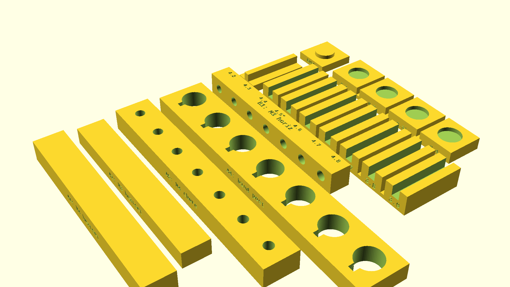

# Printing & Assembly Guide

Complete instructions for printing, calibrating, assembling, and testing the SpeedsterAI enclosure. For a project overview, see the [README](../README.md).

## Print Settings

**Material:** PETG (mandatory for airtightness and stiffness)

**Printer:** Bambu Lab H2D (350×320×325mm build volume). Both halves verified to fit within the build envelope.

| Setting | Value | Rationale |
|---------|-------|-----------|
| Layer height | 0.2mm | Good detail/speed balance |
| Perimeters | 5–6 | Fills most of 10mm wall, airtight |
| Infill | 50–80% gyroid | Fills remaining wall, adds damping |
| Top/bottom layers | 8+ | Solid baffle and back face |
| Supports | Minimal | Driver cutouts, counterbores; roundover profile is ≤45° overhang |

**Print orientation:**
- **Front half:** Baffle face DOWN (split face up) — roundover profile designed for ≤45° overhang; best surface finish on visible face
- **Back half:** Flat back face DOWN (split face up) — large flat surface on build plate for best adhesion

## Tolerance Test Print

Before printing the full enclosure, print the tolerance test to calibrate printer-specific fit tolerances. The test produces small bars with feature variants at ±0.3mm in 0.1mm increments, letting you find the exact offset for your printer/material/settings combination.



### Exporting the Test STL

```bash
openscad tolerance-test.scad -o models/tolerance-test.stl
```

### Printing the Test

The STL contains four groups that should be separated in your slicer and oriented per their intended print direction:

| Group | Features | Print Orientation |
|-------|----------|-------------------|
| Face-down plate (A1, A2, A5) | M4 heatset, M3 heatset, M4 counterbore | Holes face DOWN on bed (z=0 on bed) — tests ceiling bridging |
| Through-hole plate (A4) | Binding post keyhole | Either orientation (through-hole) |
| Horizontal plate (B1) | M3 crossover boss insert | Bores enter from side face (Y axis) |
| Mating pieces (C1–C3) | Tongue, groove strip, interlock boss/recess | Flat on bed |

**Use the same print settings as the final enclosure** (PETG, 0.2mm layers, 5–6 perimeters) so the tolerances transfer accurately.

### Testing Each Feature

Each bar has 7 variants labeled with the test diameter (e.g., 5.3, 5.4, **5.6\***, 5.7...). The nominal value is marked with an asterisk (**\***). Group labels are on the front face; diameter values are on the back face.

1. **A1 / A2 — Heat-set inserts:** Press an M4 or M3 heat-set insert into each hole using a soldering iron. Find the tightest hole that still accepts the insert cleanly without excess bulging. Record that diameter.
2. **A5 — Counterbore:** Test-fit an M4 bolt head into each counterbore pocket. The bolt should drop in freely without force. The narrower through-hole above tests the bolt shank clearance.
3. **A4 — Binding post:** Test-fit a binding post terminal. The keyway slot should prevent rotation. Find the variant where the post fits snugly.
4. **B1 — Horizontal insert:** Press an M3 heat-set insert into each horizontal bore. This tests the Z-axis print tolerance (perpendicular to layer lines), which often differs from X/Y tolerance.
5. **C1/C2 — Tongue and groove:** Slide the tongue piece into each groove channel. Find the groove width where the tongue slides smoothly without wobble.
6. **C3 — Interlock:** Press the boss piece into each recess variant. Find the clearance where the boss seats fully with light press-fit resistance.

### Applying Results

Open `speedster-ai.scad` and find the print-tuned dimension variables near the top of the file. Each variable defaults to the design nominal — replace it with the value printed on the test variant that fits best:

```openscad
// Print-tuned dimensions — enter the label value from your best-fit test variant
print_m4_heatset_dia  = 5.6;   // A1: M4 heat-set insert bore diameter
print_m3_heatset_dia  = 4.5;   // A2: M3 heat-set insert bore diameter (X/Y plane)
print_m3_heatset_z    = 4.5;   // B1: M3 heat-set insert bore diameter (horizontal/Z axis)
print_counterbore_dia = 8.0;   // A5: bolt head counterbore diameter
print_bolt_dia        = 4.5;   // A5: M4 bolt through-hole diameter
print_bp_hole_dia     = 11.7;  // A4: binding post panel hole diameter
print_bp_keyway_w     = 2.7;   // A4: binding post keyway slot width
print_groove_w        = 3.6;   // C2: groove channel width
print_interlock_clr   = 0.3;   // C3: interlock clearance per side
```

**Example:** You print the tolerance test, try pressing an M4 heat-set insert into each hole on bar A1, and find that the **5.8** variant gives the best fit. Change `print_m4_heatset_dia = 5.8;` — that value is now used for every M4 heat-set bore in the enclosure (woofer mounting, pillar inserts). No offset math required.

After updating, re-export the enclosure STLs:

```bash
./export.sh
```

## Assembly Instructions

1. Print both halves
2. Clean up supports from driver cutouts and counterbores
3. Install M4 heat-set inserts into front half pillars (8× for enclosure bolts)
4. Install M4 heat-set inserts into woofer screw holes (4× from front face)
5. Install M3 heat-set inserts into tweeter recess floor (4× from recess)
6. Install M3 heat-set inserts into crossover boss holes (6× per side wall, from cavity)
7. Mount HP crossover board on left wall, LP board on right wall, with M3 standoff screws
8. Run speaker wire from back to front through split plane
9. Press foam tape or TPU strip into groove on back half split face
10. Add polyfill loosely to cavity
11. Align tongue into groove and interlock bosses into recesses, mate halves
12. Insert 8× M4 bolts from back into front pillar inserts
13. Mount tweeter (flush into recess) with M3 screws
14. Mount woofer (surface mount) with M4 screws
15. Connect drivers to crossover
16. Install binding post plate on rear

## Bill of Materials (per speaker)

### Enclosure Assembly
| Qty | Item | Spec |
|-----|------|------|
| 8 | M4 heat-set inserts | Ø5.6mm × 8mm deep |
| 8 | M4 socket head cap screws | ~65mm length |

### Woofer Mounting
| Qty | Item | Spec |
|-----|------|------|
| 4 | M4 heat-set inserts | Ø5.6mm × 6mm deep |
| 4 | M4 socket head cap screws | 10mm length |

### Tweeter Mounting
| Qty | Item | Spec |
|-----|------|------|
| 4 | M3 heat-set inserts | Ø4.5mm × 5mm deep |
| 4 | M3 socket head cap screws | 8mm length |

### Crossover Mounting
| Qty | Item | Spec |
|-----|------|------|
| 6 | M3 heat-set inserts | Ø4.5mm × 6mm deep |
| 6 | M3 standoff screws | 8mm length |

### Seal
| Qty | Item | Spec |
|-----|------|------|
| 1 | Closed-cell foam tape | ~3mm wide, enough for perimeter |
| — | *OR* TPU filament bead | Laid into groove before mating |

### Binding Post Plate
| Qty | Item | Spec |
|-----|------|------|
| 1 | Binding post plate | Dayton Audio SBPP-SI, 100.6mm square |
| 4 | M4 heat-set inserts | Ø5.6mm × 6mm deep |
| 4 | M4 flat head (countersunk) cap screws | 8mm length, 90° head |

### Drivers & Crossover
| Qty | Item |
|-----|------|
| 1 | Tang Band W4-1720 |
| 1 | Fountek NeoCD1.0 |
| 1 | Speedster crossover (see Carmody's BOM) |
| 1 | Polyfill (loose handfuls) |

## Airtightness Test

After assembly, cover the port opening with your palm and gently push the woofer cone inward. It should resist and return slowly. If it springs back quickly, there is a leak at the split joint — check foam tape compression.
